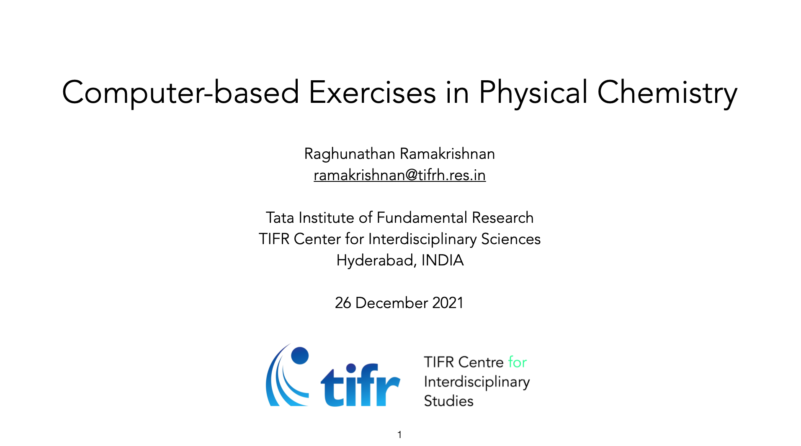

The presentation and the notebooks are prepared for the lecture Computer-based Exercises in Physical Chemistry on 26 December 2021 as a part of the program
[National Initiative on Undergraduate Science (NIUS)](https://nius.hbcse.tifr.res.in/). NIUS is an initiative of the [Homi Bhabha Centre for Science Education, TIFR](https://www.hbcse.tifr.res.in/).

